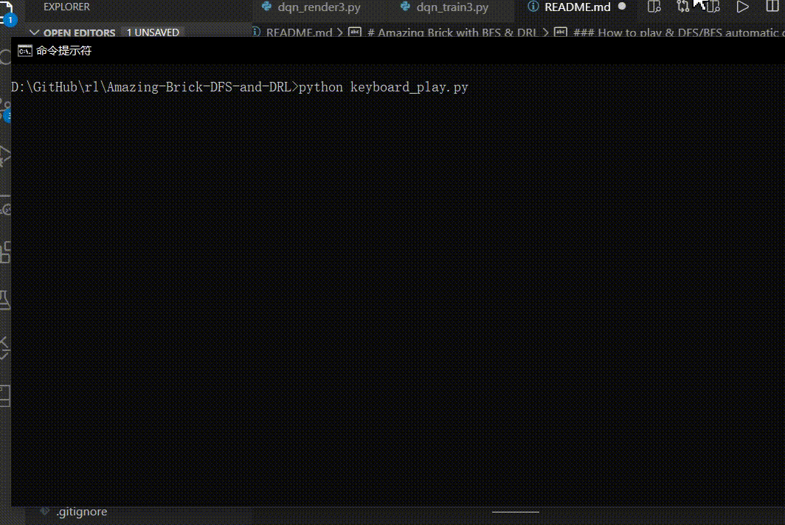
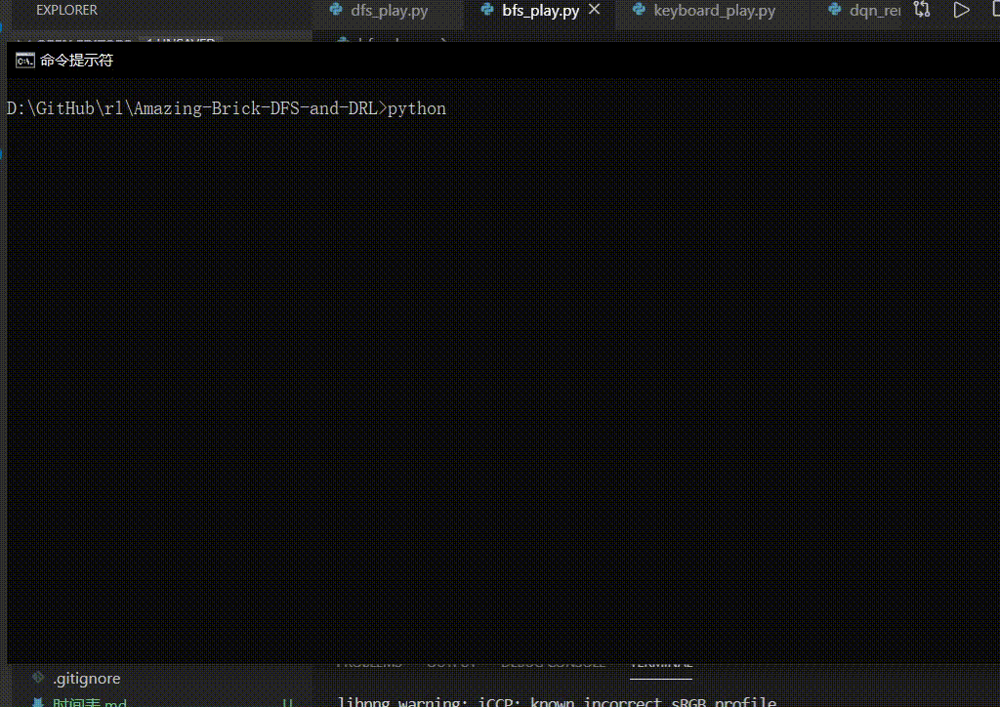
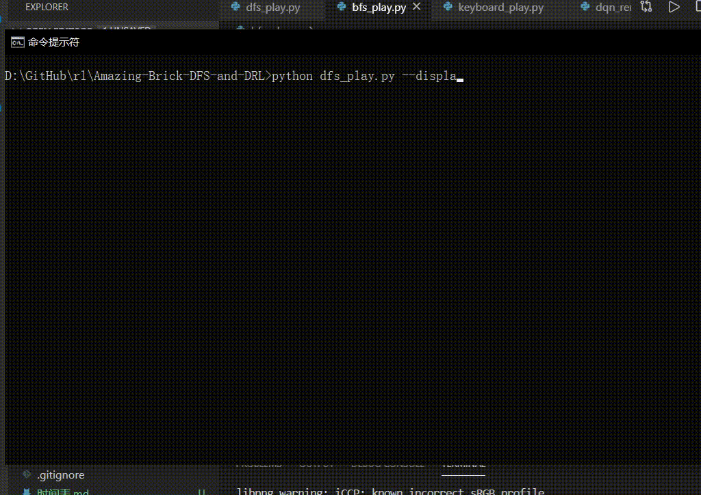
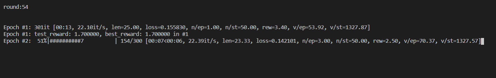
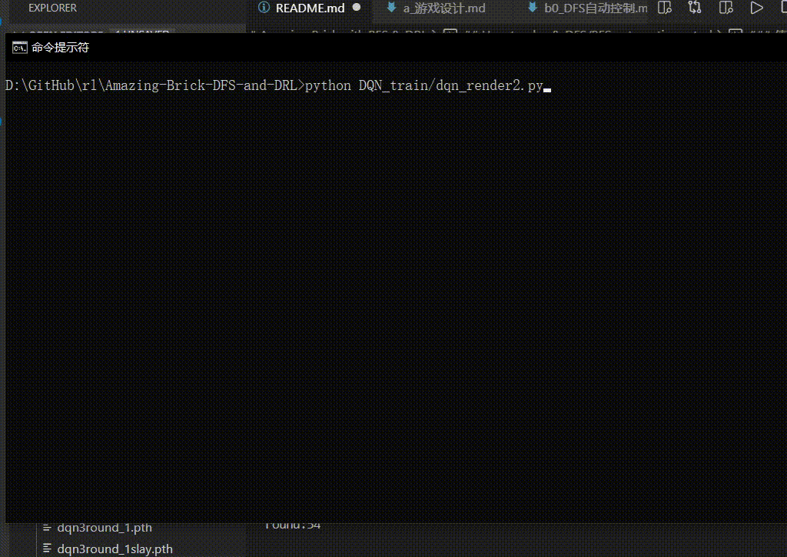
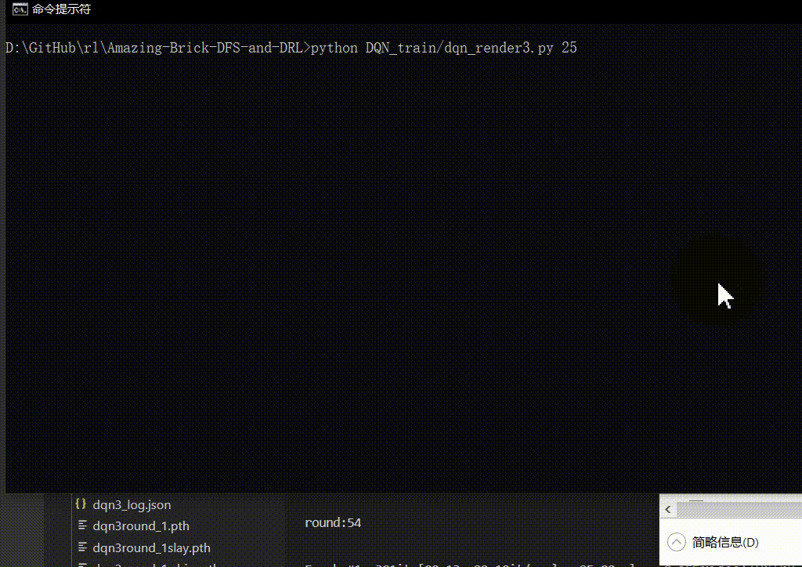

# Amazing Brick with BFS & DRL
## Preface
去年在 B 站看到大佬 UP [The CW](https://space.bilibili.com/13081489) 的视频：[用AI在手游中作弊！内藏干货：神经网络、深度/强化学习讲解](https://www.bilibili.com/video/BV1Ft411E79Y)，当时觉得很有趣，但“强化学习”这部分看的半知半解。

未曾想，导师给我定的毕设研究方向也是“强化学习”。疫情期间，在家做完毕设实验后，由于拖延症晚期，实在不想动笔写论文（尤其是“选题背景”、“选题意义”这种...）。于是便想着先复现一下这位 UP 的**游戏+算法**，与有兴趣的小伙伴们分享经验。


本项目总共花费了我两天时间（2020.5.2-2020.5.4，[查看开发时间表](./时间表.md)），本项目包括：
- 基于 pygame 的 amazing-brick 游戏复现，可以在电脑端手动玩此小游戏；
- 基于 广度优先搜索算法(BFS, Breadth-First-Search) 的自动游戏机制；
- 基于 宽度优先搜索算法(DFS, Depth-First-Search) 的自动游戏机制；
- 基于 清华开源强化学习库 tianshou 的 DQN 算法，以强化学习的方式在游戏中实现自动控制。

## Docs
我写了一些说明文件，没有使用数学公式，尽量用普通生活用语阐述：
- 我是如何设计这个小游戏的：[游戏设计](./docs/a_游戏设计.md)
- DFS 算法是怎么回事，我是怎么应用于该小游戏的：[DFS自动控制](./docs/b0_DFS自动控制.md)
- BFS 算法是怎么回事，我是怎么应用于该小游戏的：[BFS自动控制](./docs/b1_BFS自动控制.md)
- 强化学习为什么有用？其基本原理：[强化学习算法绪论](./docs/c0_强化学习算法绪论.md)
- 为了解决此问题，我构建的算法一：[基于CNNs的算法构建](./docs/c1_基于CNNs的算法构建.md)
- 为了解决此问题，我构建的算法二：[2帧输入的线性NN模型](./docs/c2_2帧输入的线性NN模型.md)
- 为了解决此问题，我构建的算法三：[输入速度的线性NN模型](./docs/c3_输入速度的线性NN模型.md)

## Requirements
前提：本项目使用/学习者至少掌握两个基本知识：
- 已经/能够配置 `python3` 开发环境；
- 能够用 `pip` 、 `conda` 或其他方式安装 `python` 依赖库。

如果不考虑 DQN_train （深度强化学习）的部分，你只需要安装两个库（绝大部分 conda 环境都已经自带）：
- numpy
- pygame

DQN_train 中的内容需要额外安装的库有：
- pytorch，安装指南：[https://pytorch.org/](https://pytorch.org/)
- tianshou，安装指南：[https://pypi.org/project/tianshou/](https://pypi.org/project/tianshou/) （直接 `pip install tianshou` 就可以）
- 可选：cv2 （openCV），如果不使用 `dqn_train.py` （强化学习算法一），可以不安装 cv2 。

## How to play & DFS/BFS automatic control
### 手动操作
在游戏中，玩家控制一个小方块，按 "\[" 键给其一个左上的力，按 "\]" 键给其一个右上的力，什么都不按，小方块会由于重力原因下落。



你可以运行 [keyboard_play.py](./keyboard_play.py) 文件，尝试手动控制该游戏。如上图，推荐使用命令行的方式启动该文件：
```bash
python keyboard_play.py
```

### 使用传统数据结构算法 DFS/BFS 自动控制
推荐使用 DFS 算法，因为我这里 DFS 算法效果较好：
```bash
python dfs_play.py
```



输入参数 `--display` 可以查看寻路过程：
```bash
python dfs_play.py --display
```



使用 BFS 算法同理：
```bash
python bfs_play.py
```

输入参数 `--display` 可以查看寻路过程：
```bash
python bfs_play.py --display
```

### 深度强化学习的训练与使用
匹配深度强化学习算法并不容易，通过不断改进，我总共尝试了三种强化学习构建匹配方案，依次为：
- 效果差：[基于CNNs的算法构建](./docs/c1_基于CNNs的算法构建.md)
- 效果中：[2帧输入的线性NN模型](./docs/c2_2帧输入的线性NN模型.md)
- 效果好：[输入速度的线性NN模型](./docs/c3_输入速度的线性NN模型.md)

你可以继续训练我的模型，也可以通过加载我保留下来的权重，查看效果。

#### 训练模型一（不推荐）
```bash
python DQN_train/dqn_train.py
```

#### 训练模型二
```bash
python DQN_train/dqn_train2.py
```



如图，我已经训练了 53 次（每次10个epoch），输入上述命令，你将开始第 54 次训练，如果不使用任务管理器强制停止，计算机将一直训练下去，并自动保存最新一代的权重。

#### 使用模型二
```bash
python DQN_train/dqn_render2.py 0
```

注意参数 0 ，**输入 0 代表使用最新的权重。**

效果如图：



此外，我保留了一些历史权重。你还可以输入参数：7, 10, 13, 21, 37, 40, 47，查看训练次数较少时，神经网络的表现。

#### 训练模型三
```bash
python DQN_train/dqn_train3.py
```

我已经训练了 40 次（每次5个epoch），输入上述命令，你将开始第 41 次训练，如果不使用任务管理器强制停止，计算机将一直训练下去，并自动保存每一代的权重。

#### 使用模型三
```bash
python DQN_train/dqn_render3.py 2
```

注意参数 2 ，**输入 2 代表使用训练 2 次后的权重。**

效果如图：


我保留了模型三的所有历史权重。你还可以输入参数：1-40，查看历代神经网络的表现。如果你继续训练了模型，你可以输入更大的参数，如 41 。

输入 25 则代表使用训练 25 次后的权重：
```bash
python DQN_train/dqn_render3.py 25
```

效果如图：



# References
本项目参考或使用了如下资源：
- [The CW](https://space.bilibili.com/13081489) 的 Bilibili 视频：[用AI在手游中作弊！内藏干货：神经网络、深度/强化学习讲解](https://www.bilibili.com/video/BV1Ft411E79Y)
- [yenchenlin](https://github.com/yenchenlin) 的 [Flappy Bird 项目](https://github.com/yenchenlin/DeepLearningFlappyBird)
