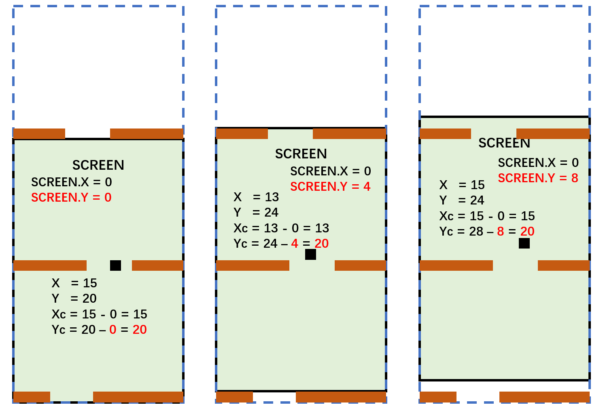
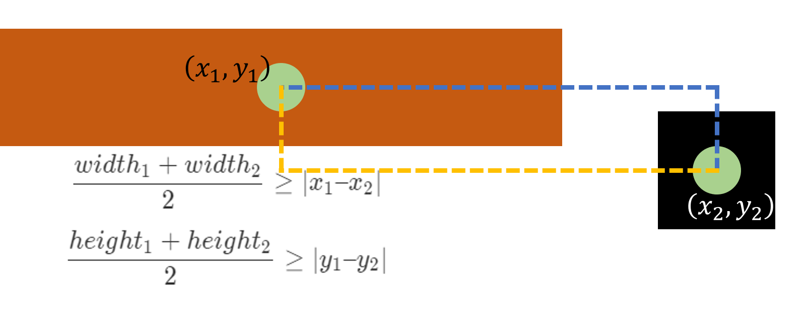

# 基于 pygame 的 Amazing-brick 实现
本文涉及三个 `.py` 文件：
```python
amazing_brick / amazing_brick_utils.py
              / wrapped_amazing_brick.py
keyboard_play.py
```


项目地址：[https://github.com/PiperLiu/Amazing-Brick-DFS-and-DRL](https://github.com/PiperLiu/Amazing-Brick-DFS-and-DRL)

> 微信公众号：Piper蛋窝

> Bilibili：枇杷鹭

# 设计思路


从玩家角度看，该游戏是动态的；但实际上，由于我没有使用已有物理引擎/游戏引擎，我是**基于每一帧**对游戏进行设计、并迭代画面的。

[keyboard_play.py](../keyboard_play.py) 在操作时，游戏类实体：`game_state.frame_step(action)` 处于一个无限循环中：
- 每执行一次 `game_state.frame_step(action)` ， `game_state` 会判断位移、是否碰撞、是否得分，并绘制这一帧，并显示；
- 默认收到的动作 `action=1` ，即什么也不干；
- 玩家按下按钮，将改变 `action` 的赋值。

### 1. 整体思路
如图，在游戏中需要绘制在屏幕上的，一共有三种实体：
- 玩家（黑色方块）；
- 方块障碍物；
- 中间留有空隙的长条障碍物。

基于这三个实体，我们主要需要考虑以下五个事件：
- 简易的物理引擎，考虑重力、阻力与加速度；
- 当玩家上升时，屏幕要随之上升；
- 检测得分，当玩家穿过间隙时，得分加一；
- 检测碰撞，当玩家碰到障碍物或撞墙时，游戏结束；
- 新建随机障碍物。

下面我将展开分别讲解上述事件的实现。

### 2. 简易的物理引擎
简易物理引擎是最简单的部分，我们为玩家（黑色方块）声明几个变量，作为定位的依据，我这里选择的是左上点 `(x, y)` 。

此外，玩家还应该具有速度变量。在 2D 空间里，速度是一个矢量（有大小，有方向），为了方便计算，我用横轴坐标方向的速度值表示 `(velX, velY)` ，即：**单位时间内的 X 、 Y 轴位移量来表示速度。**

此外，还有加速度系统。为玩家声明四个变量，分布表示重力加速度、横向空气阻力带来的加速度、按下按钮后带来的横向加速度、按下按钮后带来的纵向加速度： `gravity, dragForce, AccX, AccY` 。

因此，我们就能很轻松地实现符合物理公式的运动系统：
- 首先根据加速度计算速度；
- 接下来根据速度计算玩家应该处于什么位置。

[game/amazing_brick_utils.py](../amazing_brick/game/amazing_brick_utils.py) ：
```python
class Play:
    def __init__(self):
        self.x = ...
        self.y = ...
        self.x_= ...
        self.y_= ...
        # 如果你觉得游戏太难的话，可以改变这些物理参数
        self.gravity = 0.35
        self.dragForce = 0.01
        self.velX = 0
        self.velY = 0
        self.AccX = 4.5
        self.AccY = 2.5
    
    def lFlap(self):
        # 按下左边按钮时，玩家获得一个向左上的力
        # 因此速度发生改变
        self.velX -= self.AccX
        self.velY -= (self.AccY - self.gravity)
    
    def rFlap(self):
        # 按下右边按钮时，玩家获得一个向右上的力
        # 因此速度发生改变
        self.velX += self.AccX
        self.velY -= (self.AccY - self.gravity)
    
    def noneDo(self):
        # 没有按按钮
        # 玩家因为横向空气阻力而减缓横向速度
        # 此外，还因为重力向下加速
        if self.velX > 0:
            self.velX -= self.dragForce
        elif self.velX < 0:
            self.velX += self.dragForce
        self.velY += self.gravity
```

在 [game/wrapped_amazing_brick.py](../amazing_brick/game/wrapped_amazing_brick.py) 中，我在每帧的迭代代码中，添加了下述代码，用来根据当前速度，确定玩家的新位置：
```python
class GameState:
    def __init__(self, ifRender=True, fps=30):
        ...
    def frame_step(self, action):
        ...
        if action == 0:
            self.player.noneDo()
        elif action == 1:
            self.player.lFlap()
        elif action == 2:
            self.player.rFlap()
        ...
        # player's movement
        self.player.x += self.player.velX
        self.player.x_ += self.player.velX
        self.player.y += self.player.velY
        self.player.y_ += self.player.velY
```

### 3. 屏幕上升机制
有两个思路：
- 第一个是，让所有障碍物在每帧下移固定距离，从而造成“玩家在上升”的假象；
- 另一个是，建立一个“摄像头”，摄像头本身有一个坐标，摄像头随着玩家的上升而上升。无论是障碍物还是玩家，都有两套坐标，一套是真实的、绝对的坐标，另一套是相对于“摄像头”的坐标。我们计算碰撞时，基于前者即真实的坐标；绘图时，基于后者即相对于“摄像头”的坐标。

我采用了第二个思路。这样做的好处是，无需每时每刻对所有障碍物的坐标进行更新，且让镜头的移动更加灵活。

我在 [game/wrapped_amazing_brick.py](../amazing_brick/game/wrapped_amazing_brick.py) 中将这个“摄像头”实现了：
```python
class ScreenCamera:
    def __init__(self):
        self.x = 0
        self.y = 0
        self.width = CONST['SCREEN_WIDTH']
        self.height = CONST['SCREEN_HEIGHT']
        self.x_ = self.x + self.width
        self.y_ = self.y + self.height
    
    def __call__(self, obj: Box):
        # output the obj's (x, y) on screen
        x_c = obj.x - self.x
        y_c = obj.y - self.y
        # 每个实体：玩家、障碍物都有一套相对坐标，即 x_c, y_c
        # obj.set_camera(x_c, y_c) 将其在屏幕上的新位置告诉它
        # 绘图时，就根据其 x_c, y_c 来将其绘制在屏幕上
        obj.set_camera(x_c, y_c)
        return obj
    
    def move(self, obj: Player):
        # 如果玩家此时在屏幕上的坐标将高于屏幕的 1/2
        # 镜头上移
        # 即不允许玩家跑到屏幕上半部分去
        self(obj)
        if obj.y_c < self.height / 2:
            self.y -= (self.height / 2 - obj.y_c)
        else:
            pass
```

**值得注意的是，pygame中的坐标系是右下为正反向的。**



如图，因为相机的移动，我们的玩家一直处于屏幕中央。

# 4. 检测得分
在 [game/wrapped_amazing_brick.py](../amazing_brick/game/wrapped_amazing_brick.py) 中，我在每帧的迭代代码中，添加了下述代码，用来检测得分：
```python
class GameState:
    def __init__(self, ifRender=True, fps=30):
        ...
    def frame_step(self, action):
        ...
        # check for score
        playerMidPos = self.s_c(self.player).y_c + self.player.height / 2
        for ind, pipe in enumerate(self.pipes):
            if ind % 2 == 1:
                continue
            self.s_c(pipe)
            # 判断 Y 轴是否处于间隙中央
            if pipe.y_c <= playerMidPos <= pipe.y_c + pipe.height:
                if not pipe.scored:
                    self.score += 1
                    # 不能在一个间隙中得两次分
                    pipe.scored = True
                    # reward 用于强化学习
                    reward = 1
```

只要在Y轴方向经过了间隙中央，则得分。

# 5. 检测碰撞
以下情况视为碰撞发生，游戏结束：
- 碰到障碍物；
- 碰到边缘镜头。

其中，“碰到障碍物”用实际坐标计算：
- 对于两个物体，取其中心点；
- 当满足如下图片两个条件时，视为碰撞。



碰到边缘镜头则用相对坐标判断。

# 6. 新建障碍物
因为每次碰撞都要遍历所有障碍物，因此当障碍物淡出屏幕后，就要将障碍物从内存中删除，以确保程序不会越来越卡顿。

我使用两个列表保存所有已有障碍物：
```python
class GameState:
    def __init__(self, ifRender=True, fps=30):
        ...
        self.pipes = []
        self.blocks = []
    
    def frame_step(self, action):
        ...
        # 判断是否新增障碍物
        low_pipe = self.pipes[0]
        if self.s_c(low_pipe).y_c >= self.s_c.height - low_pipe.width \
                and len(self.pipes) < 6:
            # 满足条件，新增障碍物
            self._getRandomPipe()
        # 如果条形障碍物超出屏幕，则删除
        if self.s_c(low_pipe).y_c >= self.s_c.height \
                and len(self.pipes) > 4:
            self.pipes.pop(0)
            self.pipes.pop(0)
        
        # 如果块状障碍物超出屏幕，则删除
        for block in self.blocks:
            self.s_c(block)
            x_flag = - CONST['BLOCK_WIDTH'] <= block.x_c <= self.s_c.width
            y_flag = block.y_c >= self.s_c.height
```

此外，还需新增障碍物。这里我使用随机数生成。
```python
class GameState:
    ...
    def _getRandomPipe(self, init=False):
        if self.score % 5 == 4:
            self.color_ind = (self.color_ind + 1) % 5

        gap_left_topXs = list(range(100, 190, 20))
        if init:
            index = random.randint(0, len(gap_left_topXs)-1)
            x = gap_left_topXs[index]
            y = CONST['SCREEN_HEIGHT'] / 2 - CONST['PIPE_WIDTH'] / 2
            first_pipes = pipes(x, y, self.color_ind)
            self.pipes.append(first_pipes[0])
            self.pipes.append(first_pipes[1])
            self._addBlocks()
        index = random.randint(0, len(gap_left_topXs)-1)
        x = self.s_c.x + gap_left_topXs[index]
        y = self.pipes[-1].y - CONST['SCREEN_HEIGHT'] / 2
        pipe = pipes(x, y, self.color_ind)
        self.pipes.append(pipe[0])
        self.pipes.append(pipe[1])
        self._addBlocks()
    
    def _addBlocks(self):
        x = (self.pipes[-2].x_ + self.pipes[-1].x) / 2
        y = (self.pipes[-2].y + self.pipes[-2].y_) / 2
        for i in range(2, 0, -1):
            y_block = y + i * CONST['BLOCK_SPACE']
            x_block = x + np.random.normal() * CONST['PIPE_GAPSIZE'] / 2.5
            block = Block(x_block, y_block, self.color_ind)
            self.blocks.append(block)
```

# 程序结构
## amazing_brick
整个游戏的核心，包括负责加载图片与存储实体类的 `amazing_brick_utils.py` 与运算迭代用的 `wrapped_amamzing_brick.py` 。

### amazing_brick_utils.py
依次实现以下功能：
- 设置尺寸常量；
- 加载图片；
- 声明实体类。

### wrapped_amamzing_brick.py
包含：
- 相机类；
- 计算迭代绘图类（核心）。

## keyboard_play.py
用于与玩家交互。

```python
import os.path as osp
import sys
dirname = osp.dirname(__file__)
sys.path.append(dirname)

import pygame
from amazing_brick.game.wrapped_amazing_brick import \
        GameState, SCREEN

game_state = GameState(True)
ACTIONS = (0, 1, 2)

while True:
    action = ACTIONS[0]
    for event in pygame.event.get():
        if event.type == pygame.QUIT:
            sys.exit()
        if event.type == pygame.KEYDOWN:
            if event.key == pygame.K_LEFTBRACKET:
                action = ACTIONS[1]
            if event.key == pygame.K_RIGHTBRACKET:
                action = ACTIONS[2]

    game_state.frame_step(action)
pygame.quit()
```

在游戏中，玩家控制一个小方块，按 "\[" 键给其一个左上的力，按 "\]" 键给其一个右上的力，什么都不按，小方块会由于重力原因下落。


你可以运行 [keyboard_play.py](./keyboard_play.py) 文件，尝试手动控制该游戏。如上图，推荐使用命令行的方式启动该文件：
```bash
python keyboard_play.py
```

源码：[https://github.com/PiperLiu/Amazing-Brick-DFS-and-DRL](https://github.com/PiperLiu/Amazing-Brick-DFS-and-DRL)

欢迎 star 。