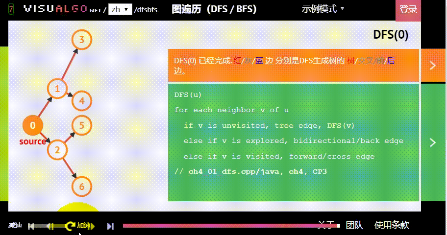
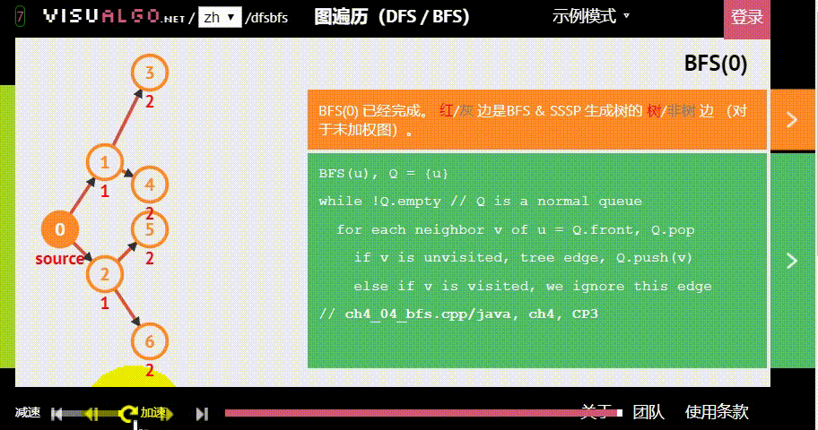
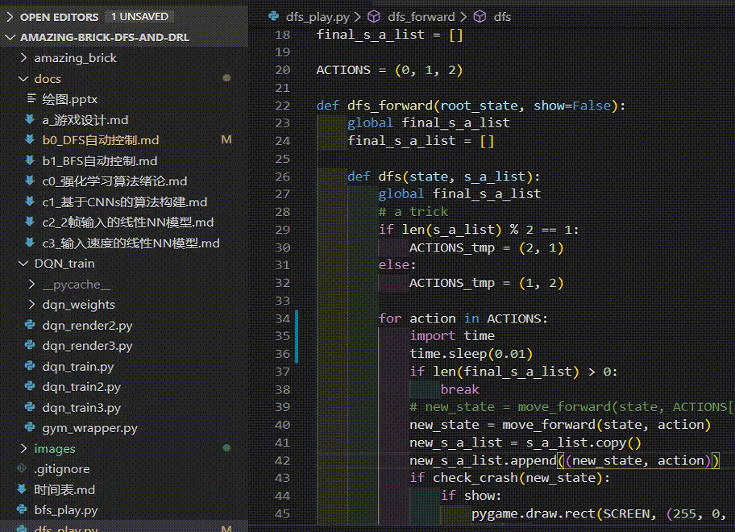

# 使用深度优先搜索方法实现游戏的自动控制
本文涉及一个 `.py` 文件：
```python
dfs_play.py
```

如上图，我们将使用“深度优先搜索”的方法，来控制黑色方块自动闯关。

所谓“深度优先搜索”，即：
- 搜索：精准预测行一步操作后，黑色方块将到达什么位置；并再次精准预测在这个位置进行操作后，黑色方块将到达什么位置...直到触发终止条件，即找到最终得分的路径；
- 深度优先：假设黑色方块有两个动作可以选择：A与B，那么黑色方块做出“选择A后应该到达的位置”的预测后，继续接着这条路径预测，而非去预测在初始状态下“选择B后应该到达的位置”。具体原理如下图。


图片生成自：[https://visualgo.net/zh/dfsbfs](https://visualgo.net/zh/dfsbfs)

为了更好地了解 DFS 的特性，你可以用 BFS（广度优先搜索） 进行对比：


# 如何用 DFS 匹配我们的小游戏

在我写的小游戏（小游戏[项目地址](https://github.com/PiperLiu/Amazing-Brick-DFS-and-DRL)，小游戏[代码结构详解](https://github.com/PiperLiu/Amazing-Brick-DFS-and-DRL/blob/master/docs/a_%E6%B8%B8%E6%88%8F%E8%AE%BE%E8%AE%A1.md)）中，我们的小方块时刻面临三个选择：
- 给自己一个左上的力；
- 给自己一个右上的力；
- 什么也不做，这一时刻任由自己受重力牵制而掉落。

因此，我们每层也就有三个结点，如下图：


但是因为算法本身的时间复杂度过大，我们可以不考虑“什么也不做”这一动作。否则，将如下图，需要搜索的结点过多，导致程序运行过慢或内存溢出。

这样，每层的父结点就只有两个子结点，大大减少需要遍历的空间。


# 使用递归的实现
我使用递归来实现 DFS 算法，我大概描述一下这个过程。数据结构不够硬的同学，应该静下心来读读我的源码、或者其他经典的 DFS 教程、或者刷刷 LeetCode 。

我的源码见：[../dfs_play.py](../dfs_play.py)
```python
final_s_a_list = []
def dfs_forward(root_state, show=False):
    # 最后需要返回的就是这个(状态、动作)列表
    global final_s_a_list
    final_s_a_list = []

    # 在内部定义 dfs ，用于递归
    # 在递归过程中，修改 final_s_a_list 的值
    # 总是保留目前最优解
    def dfs(state, s_a_list):
        global final_s_a_list
        # a trick
        # 每次结点的排列都不一样
        # 这样搜索速度更快
        # 能更快地找到可行解
        if len(s_a_list) % 2 == 1:
            ACTIONS_tmp = (2, 1)
        else:
            ACTIONS_tmp = (1, 2)
        
        for action in ACTIONS_tmp:
            if len(final_s_a_list) > 0:
                break
            new_state = move_forward(state, action)
            new_s_a_list = s_a_list.copy()
            new_s_a_list.append((new_state, action))
            if check_crash(new_state):
                if show:
                    # 绘图部分
                    pygame.draw.rect(SCREEN, (255, 0, 0), \
                            (new_state['x'] - game_state.s_c.x, new_state['y'] - game_state.s_c.y, game_state.player.width, game_state.player.height))
                    pygame.display.update()
                del new_state
                del new_s_a_list
            else:
                if show:
                    # 绘图部分
                    pygame.draw.rect(SCREEN, (100, 100, 100), \
                            (new_state['x'] - game_state.s_c.x, new_state['y'] - game_state.s_c.y, game_state.player.width, game_state.player.height))
                    pygame.display.update()
                if check_for_score(new_state):
                    if show:
                        # 绘图部分
                        pygame.draw.rect(SCREEN, (0, 0, 255), \
                                (new_state['x'] - game_state.s_c.x, new_state['y'] - game_state.s_c.y, game_state.player.width, game_state.player.height))
                        pygame.display.update()
                    final_s_a_list = new_s_a_list
                    break
                dfs(new_state, new_s_a_list)

    # 开始递归
    dfs(root_state, [])

    return final_s_a_list
```

我这里 DFS 算法效果较好：
```bash
python dfs_play.py
```

输入参数 `--display` 可以查看寻路过程：
```bash
python dfs_play.py --display
```


源码：[https://github.com/PiperLiu/Amazing-Brick-DFS-and-DRL](https://github.com/PiperLiu/Amazing-Brick-DFS-and-DRL)

欢迎 star 。
