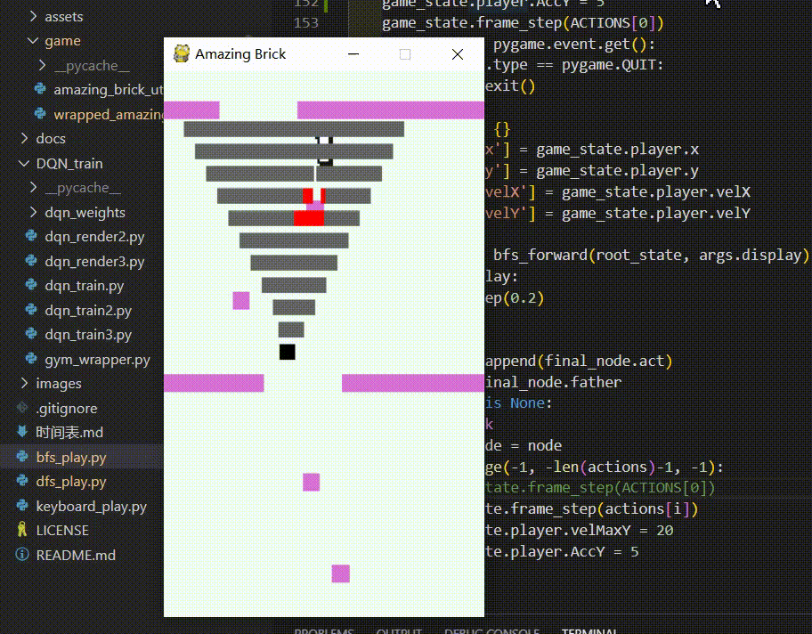

# 使用广度优先搜索方法实现游戏的自动控制
本文涉及一个 `.py` 文件：
```python
bfs_play.py
```

如上图，我们将使用“广度优先搜索”的方法，来控制黑色方块自动闯关。

所谓“广度优先搜索”，即：
- 搜索：精准预测下一步操作后，黑色方块将到达什么位置；并再次精准预测在这个位置进行操作后，黑色方块将到达什么位置...直到触发终止条件，即找到最终得分的路径；
- 广度优先：假设黑色方块有两个动作可以选择：A与B，那么黑色方块做出“选择A后应该到达的位置”的预测后，不继续接着这条路径预测；而是去预测在初始状态下“选择B后应该到达的位置”。具体原理如下图。


图片生成自：[https://visualgo.net/zh/dfsbfs](https://visualgo.net/zh/dfsbfs)

为了更好地了解 BFS 的特性，你可以用 DFS（深度优先搜索） 进行对比：


# 如何用 BFS 匹配我们的小游戏

在我写的小游戏（小游戏[项目地址](https://github.com/PiperLiu/Amazing-Brick-DFS-and-DRL)，小游戏[代码结构详解](https://github.com/PiperLiu/Amazing-Brick-DFS-and-DRL/blob/master/docs/a_%E6%B8%B8%E6%88%8F%E8%AE%BE%E8%AE%A1.md)）中，我们的小方块时刻面临三个选择：
- 给自己一个左上的力；
- 给自己一个右上的力；
- 什么也不做，这一时刻任由自己受重力牵制而掉落。

因此，我们每层也就有三个结点，如下图：


但是因为算法本身的时间复杂度过大，我们可以不考虑“什么也不做”这一动作。这样，每层的父结点就只有两个子结点，大大减少需要遍历的空间。否则，需要搜索的结点过多，导致程序运行过慢或内存溢出。

# 使用队列的实现
我使用队列来实现 BFS 算法，我大概描述一下这个过程。数据结构不够硬的同学，应该静下心来读读我的源码、或者其他经典的 BFS 教程、或者刷刷 LeetCode 。

我的源码见：[../bfs_play.py](../bfs_play.py)
```python
Node = namedtuple("Node", ['sta' , 'act', 'father'])

game_state = GameState(True)
# 为了避免搜索空间过大
# 这里调高了游戏的力学参数
game_state.player.velMaxY = 20
game_state.player.AccY = 5

ACTIONS = (0, 1, 2)

def bfs_forward(root_state, show=False):
    # 保存结点的队列
    q = Queue()
    for action in ACTIONS:
        node = Node(root_state.copy(), action, None)
        q.put(node)
    
    while True:
        # 如果队列为空
        # 则说明所有可行结点已经遍历
        if q.empty():
            break
        father_node = q.get()
        father_state = father_node.sta
        if check_for_score(father_state):
            # 如果得分
            # 说明可行路径已经找到
            # 跳出循环
            if show:
                pygame.draw.rect(SCREEN, (0, 0, 255), \
                        (father_state['x'] - game_state.s_c.x, father_state['y'] - game_state.s_c.y, game_state.player.width, game_state.player.height))
                pygame.display.update()
            break
        # 只考虑动作 1 和 2
        for action in ACTIONS[1:]:
            # father_state = move_forward(father_state, ACTIONS[0])
            new_state = move_forward(father_state, action)
            if check_crash(new_state):
                if show:
                    pygame.draw.rect(SCREEN, (255, 0, 0), \
                            (new_state['x'] - game_state.s_c.x, new_state['y'] - game_state.s_c.y, game_state.player.width, game_state.player.height))
                    pygame.display.update()
            else:
                if show:
                    pygame.draw.rect(SCREEN, (100, 100, 100), \
                            (new_state['x'] - game_state.s_c.x, new_state['y'] - game_state.s_c.y, game_state.player.width, game_state.player.height))
                    pygame.display.update()
                node = Node(new_state, action, father_node)
                q.put(node)
    
    return father_node
```

我这里 BFS 算法效果不好：
```bash
python bfs_play.py
```
输入输入参数 `--display` 可以查看寻路过程：
```bash
python bfs_play.py --display
```


源码：[https://github.com/PiperLiu/Amazing-Brick-DFS-and-DRL](https://github.com/PiperLiu/Amazing-Brick-DFS-and-DRL)

欢迎 star 。
