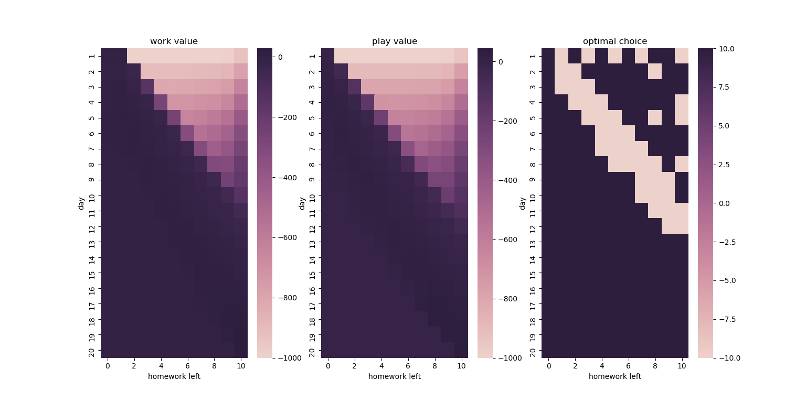

# 不用公式、不用代码，白话讲讲强化学习原理
> The best way to learn is to teach others.

在说强化学习之前，我们先来聊聊他的两个兄弟：监督学习和无监督学习。

### 监督学习
监督学习就是，你喂给机器一堆`有标签的数据`，比如下表这样。

|特征值|标签|
|---|---|
|小明, 爱穿裙子, 出门前化妆|女孩|
|小张, 不穿裙子, 出门前不妆|男孩|
|...|...|
|小何, 爱穿裙子, 出门前不妆|男孩|

经过对有标签数据的`训练`/`学习`后，我们就得到了一个`分类器`/`回归器`，可以根据`无标签的数据`推测出其标签。

|特征值|`AI所推测出的标签`|
|---|---|
|小钗, 爱穿裙子, 出门前化妆|`女孩`|
|小黛, 爱穿裙子, 出门前化妆|`女孩`|
|小盘, 不穿裙子, 出门前不妆|`男孩`|

### 无监督学习
无监督学习就是，你喂给机器一堆`无标签的数据`，比如下表这样。

|特征值|标签|
|---|---|
|(1,1,1,1)|None|
|(1,4,-2,3)|None|
|(-1,2,0,0)|None|
|(1000,-2,4,1)|None|
|...|...|
|(0,1,-2,0)|None|

经过对上述数据的`训练`/`学习`后，机器自动总结规律，给上述数据打标签，如下表这样。

|特征值|`AI给的标签`|
|---|---|
|(1,1,1,1)|不是离群点|
|(1,4,-2,3)|不是离群点|
|(-1,2,0,0)|不是离群点|
|(1000,-2,4,1)|是离群点|
|...|...|
|(0,1,-2,0)|不是离群点|

此时，你再向机器中输入新的无标签数据，机器也能`根据旧数据训练出的阈值`，告诉你新数据的标签，如下。

|特征值|`AI所推测出的标签`|
|---|---|
|(0,0,0,0)|不是离群点|
|(100,-121,-2,3)|是离群点|

## 强化学习
OK，了解上面这些，我们就要讨论`强化学习`了。

前面`监督学习`和`无监督学习`已经分别为`有标签数据`和`无标签数据`提供解决办法了，还有什么新花样吗？何谓`强化`？

别急，我们先看现实生活中的一个例子。

### 生活实例：写不完寒假作业的小赛？
小赛是一名初中生，平时喜欢打电脑游戏，也是一位典型的拖延症晚期患者（不喜欢写作业）。

又到了寒假，小赛从学校领了几本厚厚的基本练习册回家，心想，先玩一天电脑游戏再考虑如何安排作业的事吧。

从小赛的兴趣出发，我们得到下表。

|做某事|小赛大脑获得的奖励值|
|---|---|
|写一整天作业，这天只玩一点游戏|-5|
|玩一整天游戏，这天只写一点作业|10|
|没写完作业，被骂|-1000|

上表所说的`奖励值`是客观存在的，是常数，不可人为改变。

此外，基于这个情景，我们做出三条假设：
- 小赛是理性人，他总是`期望之后总奖励值最高`；
- 小赛的寒假有20天；
- 作业需要10天写完。

那么，基于这个奖励值和规则，小赛会如何安排写作业计划呢？
- 什么也不管，先玩痛快！被骂就被骂吧！
- 先忍痛10天，把作业写完！
- 合理规划。

上述方案，好像只有第三个`合理规划`是合理的。那么，如何规划才称得上`合理`呢？我们可以交给`今天的C位——强化学习`来解决。

### 强化学习帮助小赛“实时决策”
为了突出强化学习的能力，首先来看看`监督学习`的表现：
- 写作业奖励值是 -5 ，玩游戏奖励值是 10 ，总目标是奖励值最大？
- 我不管，既然`让我输出数值大的决策`，我就`每次都建议小赛去玩游戏`！

监督学习并不适合实时决策问题，因为它是`短视的`。

换个角度，`强化学习能够考虑作出决策后，会如何影响接下来的进展及一系列决策`，因此`强化学习的实时决策总是远视的`。

强化学习是如何做到“远视”的呢？

在算法迭代中，强化学习在自己的逻辑中逐渐建立了下表：
|(寒假剩余天数, 剩余作业量)|写作业还是玩游戏|
|---|---|
|(20, 10)|建议玩游戏|
|(19, 10)|建议玩游戏|
|(18, 10)|建议玩游戏|
|...|...|
|(19, 9)|建议写作业|
|(18, 9)|建议写作业|
|...|...|
|(10, 0)|建议玩游戏|

强化学习是`如何计算出当前“玩游戏好一点”还是“写作业好一点”呢`？这就是那些`算法工程师+科研人员`的事了。

我针对这个问题简单写了个 Sarsa 算法，代码在 [./sack_srasa.py](./sack_srasa.py) 。

最后，通过多次迭代，得到的`状态-动作价值表`如下：
|(剩余假期, 剩余作业)|写作业价值|玩游戏价值|AI的建议|
|---|---|---|---|---|
|(20, 10)|28.27|44.14|建议玩游戏|
|(19, 10)|32.58|45.64|建议玩游戏|
|(18, 10)|19.83|31.30|建议玩游戏|
|...|...|...|...|...|
|(12, 10)|-29.14|-52.96|建议写作业|
|(11, 10)|-65.91|-99.18|建议写作业|
|...|...|...|...|...|
|(9, 10)|-188.48|-163.67|建议玩游戏|
|(1, 1)|0.00|-920.23|建议写作业|
|...|...|...|...|...|

可见，我们的 AI 推荐我们在不紧急的情况下先玩个痛快；但是，邻近 DDL 时，我们的 AI 会理性地建议写作业，比如：
- `还剩12天有10天量的作业`时，写作业的价值大于玩游戏；
- `还剩11天有10天量的作业`时，写作业的价值大于玩游戏；
- `还剩9天有10天量的作业`时，写作业的价值`小于`玩游戏（反正最后也是挨批，不如不写了）；
- `还剩1天有1天量的作业`时，写作业的价值`远大于`玩游戏（成败在此一举，不写简直是作死）。

我基于我的代码生成了一张图片。

最右边，深色代表`当前状态下建议玩游戏`，肉色代表`当前状态下建议写作业`。横轴是作业剩余量，纵轴是假期剩余天数。

所以你看，一个简单的 Sarsa 算法就能够评估各个情况下，采用什么决策最优，且`做出的决策都符合人的思维、是远视的`，强化学习是不是很神奇？

### 强化学习特点
话说回来，强化学习为什么叫“强化”呢？我认为这与强化学习的几个特点有关：
- 无论是训练还是应用，都需要与环境进行实时交互；
- 在训练中，通过历史经验，未来的状态与奖励回溯到现有的状态中，强化现在的动作的价值。

强化学习的迭代过程较为复杂，其计算的并不仅仅是目标值与预测值之间的差（或者说，强化学习在学习的过程中并没有目标值）。

如何将强化学习设计得“远视”，如何在数学理论上能取得“收敛”、“稳定”的效果，是前沿研究人员离不开的问题。

已经有很多数学基础扎实的科学家，为强化学习算法提供了稳定、数学理论上收敛的框架（提出的算法框架`可能用起来简单`，但`提出它的过程可谓伟大`），后人因此颇为受益。

我在公众号 Piper蛋窝 以及 CSDN 上写了一个强化学习的编程小教程，在这个教程中，我详细介绍了如何用 pygame 写一个小游戏（也是我们之后测试强化学习的环境）、传统算法与强化学习效果上、应用上的区别：
- 基于 pygame 的 amazing-brick 游戏复现，可以在电脑端手动玩此小游戏；
- 基于 广度优先搜索算法(BFS, Breadth-First-Search) 的自动游戏机制；
- 基于 宽度优先搜索算法(DFS, Depth-First-Search) 的自动游戏机制；
- 基于 清华开源强化学习库 tianshou 的 DQN 算法，以强化学习的方式在游戏中实现自动控制。

GitHub 地址：[https://github.com/PiperLiu/Amazing-Brick-DFS-and-DRL](https://github.com/PiperLiu/Amazing-Brick-DFS-and-DRL)
