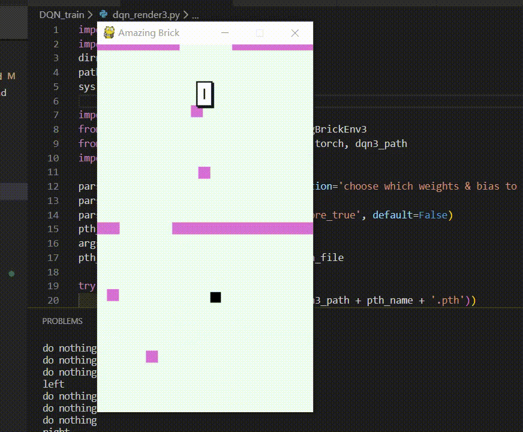
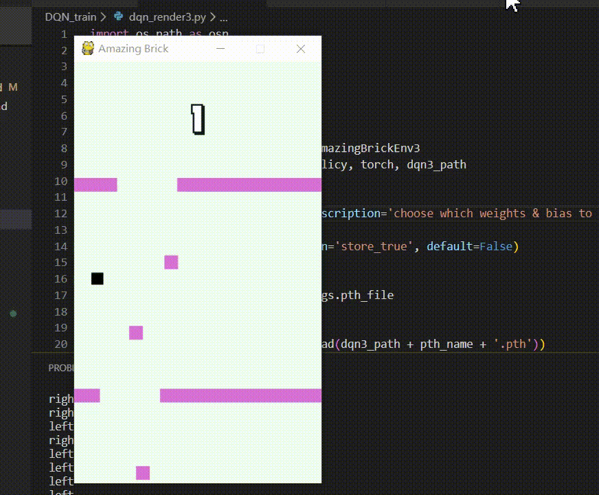

# 构造一个输入速度的神经网络，实现 DQN
本文涉及的 `.py` 文件有：
```
DQN_train/gym_warpper.py
DQN_train/dqn_train3.py
DQN_train/dqn_render3.py
```

## requirements
```
tianshou
pytorch > 1.40
gym
```
## 继续训练与测试
在本项目地址中，你可以使用如下文件对我训练的模型进行测试，或者继续训练。

#### 继续训练该模型
```bash
python DQN_train/dqn_train3.py
```

我已经训练了 40 次（每次5个epoch），输入上述命令，你将开始第 41 次训练，如果不使用任务管理器强制停止，计算机将一直训练下去，并自动保存每一代的权重。

#### 查看效果
```bash
python DQN_train/dqn_render3.py 3
```

注意参数 3 ，**输入 3 代表使用训练 3 次后的权重。**

效果如图：


我保留了该模型的所有历史权重。你还可以输入参数：1-40，查看历代神经网络的表现。如果你继续训练了模型，你可以输入更大的参数，如 41 。

输入 10 则代表使用训练 10 次后的权重：
```bash
python DQN_train/dqn_render3.py 25
```

效果如图：


输入 30 则代表使用训练 30 次后的权重：
```bash
python DQN_train/dqn_render3.py 30
```

效果如图：


## 封装交互环境
上一个模型的效果并不好，这个模型的表现却很值得称道。我对这个模型做出了什么改进呢？

|事件|奖励|
|---|---|
|动作后碰撞障碍物、墙壁|-1|
|动作后无事发生|0.0001|
|动作后得分|1|
|在第一层滞留过久（超过500步）|-10|

可以看出，我将`动作后无事发生`的奖励从 0.1 降低到了 -1 ，是为了：
- 突出`动作后得分`这项的奖励；
- 如此，智能体第一次得分后，会很“欣喜地发现”上升一层的快乐远远大于在第一层苟命的快乐。

此外，如果智能体`在第一层滞留过久`，也是会受到 -10 的惩罚的：
- 这是为了告诉智能体，在第一层过久是不被鼓励的；
- 因为状态是链式的，因此最后的惩罚会回溯分配到之前的“苟命”策略上。

封装代码在 [gym_wrapper.py](../DQN_train/gym_wrapper.py) 中，使用类 `AmazingBrickEnv3` 。

## 强化学习机制与神经网络的构建
上节中，我们将 2 帧的数据输入到线性层中，效果并不理想。我进一步`帮助机器提取了信息`，并且`预处理了数据`：
- 不再将巨大的 2 帧数据输入到网络中；
- 取而代之的是，当前状态的速度向量`(velx, vely)`；
- 再加上`玩家xy坐标`、`左障碍物右上顶点xy坐标`、`右障碍物左上顶点xy坐标`、`4个障碍方块的左上顶点的xy坐标`（共14个数）；
- 如此，输入层只有 16 个神经网即可，且每 1 帧做一次决策。

我还放慢了 epsilon （探索概率）的收敛速度，让智能体更多地去探索动作，不局限在局部最优解中。

**此外，我对输入数据进行了归一化处理比如，玩家的坐标 x, y 分别除以了屏幕的 宽、高。从结果和训练所需的代数更少来看，我认为这对于机器学习有极大的帮助。**

#### 线性神经网络的构建
```python
class Net(nn.Module):
    def __init__(self):
        super().__init__()
        self.fc1 = nn.Linear(16, 128)
        self.fc2 = nn.Linear(128, 256)
        self.fc3 = nn.Linear(256, 128)
        self.fc4 = nn.Linear(128, 3)
    def forward(self, obs, state=None, info={}):
        if not isinstance(obs, torch.Tensor):
            obs = torch.tensor(obs, dtype=torch.float)
        x = F.relu(self.fc1(obs))
        x = F.relu(self.fc2(x))
        x = F.relu(self.fc3(x))
        x = self.fc4(x)
        return x, state
```
如上，共四层线性网络。

## 记录训练的微型框架
为了保存训练好的权重，且在需要时可以暂停并继续训练，我新建了一个`.json`文件用于保存训练数据。
```python
dqn2_path = osp.join(path, 'DQN_train/dqn_weights/')

if __name__ == '__main__':

    try:
        with open(dqn3_path + 'dqn3_log.json', 'r') as f:
            jlist = json.load(f)
        log_dict = jlist[-1]
        round = log_dict['round']
        policy.load_state_dict(torch.load(dqn3_path + 'dqn3round_' + str(int(round)) + '.pth'))
        del jlist
    except FileNotFoundError as identifier:
        print('\n\nWe shall train a bright new net.\n')
        # 第一次训练时，新建一个 .json 文件
        # 声明一个列表
        # 以后每次写入 json 文件，向列表新增一个字典对象
        with open(dqn3_path + 'dqn3_log.json', 'a+') as f:
            f.write('[]')
            round = 0
    while True:
        round += 1
        print('\n\nround:{}\n\n'.format(round))
        

        result = ts.trainer.offpolicy_trainer(
            policy, train_collector, test_collector,
            max_epoch=max_epoch, step_per_epoch=step_per_epoch,
            collect_per_step=collect_per_step,
            episode_per_test=30, batch_size=64,
            # 如下，每新一轮训练才更新 epsilon
            train_fn=lambda e: policy.set_eps(0.1 / round),
            test_fn=lambda e: policy.set_eps(0.05 / round), writer=None)
        print(f'Finished training! Use {result["duration"]}')

        torch.save(policy.state_dict(), dqn3_path + 'dqn3round_' + str(int(round)) + '.pth')
        policy.load_state_dict(torch.load(dqn3_path + 'dqn3round_' + str(int(round)) + '.pth'))
        
        log_dict = {}
        log_dict['round'] = round
        log_dict['last_train_time'] = datetime.datetime.now().strftime('%y-%m-%d %I:%M:%S %p %a')
        log_dict['best_reward'] = result['best_reward']
        with open(dqn3_path + 'dqn3_log.json', 'r') as f:
            """dqn3_log.json should be inited as []"""
            jlist = json.load(f)
        jlist.append(log_dict)
        with open(dqn3_path + 'dqn3_log.json', 'w') as f:
            json.dump(jlist, f)
        del jlist
```

## DQN
```python
import os.path as osp
import sys
dirname = osp.dirname(__file__)
path = osp.join(dirname, '..')
sys.path.append(path)

from amazing_brick.game.wrapped_amazing_brick import GameState
from amazing_brick.game.amazing_brick_utils import CONST
from DQN_train.gym_wrapper import AmazingBrickEnv3

import tianshou as ts
import torch, numpy as np
from torch import nn
import torch.nn.functional as F
import json
import datetime

train_env = AmazingBrickEnv3()
test_env = AmazingBrickEnv3()

state_shape = 16
action_shape = 1

net = Net()
optim = torch.optim.Adam(net.parameters(), lr=1e-3)


'''args for rl'''
estimation_step = 3
max_epoch = 5
step_per_epoch = 300
collect_per_step = 50


policy = ts.policy.DQNPolicy(net, optim,
    discount_factor=0.9, estimation_step=estimation_step,
    use_target_network=True, target_update_freq=320)

train_collector = ts.data.Collector(policy, train_env, ts.data.ReplayBuffer(size=2000))
test_collector = ts.data.Collector(policy, test_env)
```

采用这种方式获得了不错的效果，在第 40 代训练后（共 40 * 5 * 300 = 6000 个 step），智能体已经能走 10 层左右。

相信继续的迭代会获得更好的成绩。

项目地址：[https://github.com/PiperLiu/Amazing-Brick-DFS-and-DRL](https://github.com/PiperLiu/Amazing-Brick-DFS-and-DRL)

本项目的说明文件到此结束。感谢你的阅读，欢迎提交更好的方案与意见！
